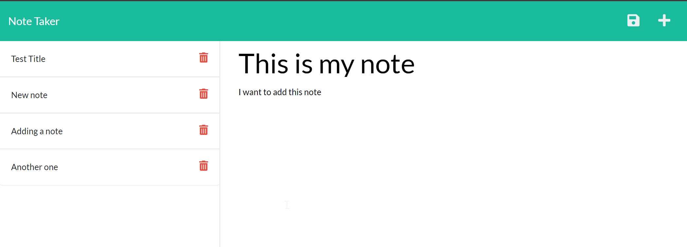

# note_taker

## Description
This application saves notes to the database, which can then be deleted.
## Table of Contents
- [Installation](#installation)
- [Usage](#usage)
- [Credits](#credits)
## Installation
The app can be accesed from this [heroku app page](https://jorge-note-taker.herokuapp.com/) and it is stored in this [github repository]().
## Usage
The user types the title and text of their note in the corresponding placeholder and then click on the save icon to add the note.

## Credits
Credits go to the UW coding bootcamp instructional team.
## Tests
Testing was done through using the app directly